#### 一、模板设计模式（Template Method）

对应代码chapter1

##### 1、动机

```shell
a、在软件构建过程中,对于某一项任务,它常常有稳定的整体操作结构，但各个步骤却有很多改变的需求,或者由于固有的原因(比如框架与应用之间的关系)而无法个和任务的整体结构同时实现。
b、如何在确定稳定操作结构的前提下，来灵活应对各个步骤的变化或者晚期实现需求？

```

##### 2、模式定义:

```shell
  定义一个操作中的算法的骨架(稳定),而将一些步骤延迟(变化)到子类中。Template Method 使得子类可以不改变(复用)一个算法的结构
即可重定义(Override 重写)该算法的某些特定步骤。

```

##### 3、要点总结

```shell
a、 Template Method 模式是一种非常基础性的设计模式,在面向对象系统中有着大量的应用。它用最简洁的机制(虚函数的多态性) 为很多应用程序框架提供了灵活的扩展点，是代码复用方面的基本实现结构。
 
b、除了可以灵活应对子步骤的变化外，"不要调用我,让我来调用你"的反向控制结构是Template Method的典型应用。

c、在具体实现方面，被Template Method 调用的虚方法可以具有实现,也可以没有任何实现(抽象方法、纯虚方法),但一般推荐将它们设置为protected方法。 （如果将其作为public方法 给外部单独调用是没有意义的。往往要放到一个流程里面去才有意义，就是你的前面和后面要有铺垫调用起来才有意义，所以一般不供外交调用。）

```


#### 二、策略设计模式（Strategy）

对应代码chapter2

##### 1、动机

```shell
a、在软件构建过程中,某些对象使用的算法可能多种多样,经常改变,如果将这些算法都编码到对象中,将会使对象变得异常复杂；而且有时候支持不使用的算法是一个性能负担。
b、如何在运行时根据需要透明地更改对象的算法？将算法与对象本身解耦,从而避免上述问题？

很多问题如果从静态方面来看是看不出什么问题的，但是将问题放在时间轴里面来看这个问题就会有不同的角度

```

##### 2、模式定义

```shell
定义一系列算法,把它们一个个封装起来，并且使它们可互相替换(变化)。该模式使得算法可以独立于使用它的客户程序(稳定)而变化(扩展，子类化)。
```

##### 3、要的总结

```shell
a、Strategy及其子类为组件提供了一系列可重用的算法,从而可以使得类型在运行时方便地根据需要在各个算法之间进行切换
b、Strategy模式提供了用条件判断语句以外的另一种选择,消除条件判断语句，就是在解耦合。含有许多条件判断语句的代码通常都需要Strategy模式。
c、如果Strategy对象没有实例变量,那么各个上下文可以共享同一个Strategy对象，从而节省对象开销。
```

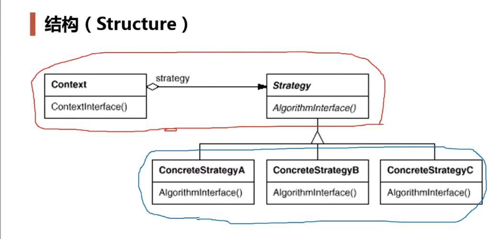


#### 三、观察者模式（Observer/Event）

对应代码chapter3

##### 1、"组件模式"

```shell
现代软件专业分工之后的第一个结果是"框架与应用程序的划分"，"组件协作"模式通过晚期绑定，来实现框架与应用程序之间的松耦合，是二者之间协作时常用的模式。

典型模式有：
 Template Method
 Strategy
 Observer/Event

```


##### 2、动机(Motivation):

```shell
a、在软件构建过程中,我们需要为某些对象建立一种"通知依赖关系"------ 一个对象(目标对象)的状态发生改变，所有的依赖对象(观察者对象)都将得到通知。如果这样依赖关系过于紧密，将使软件不能很好地抵御变化。

b、使用面向对象技术，可以将这种依赖关系弱化，并形成一种稳定的依赖关系。从而实现软件体系结构的松耦合。

```


##### 3、模式定义：

```shell
定义对象间的一种一对多(变化)的依赖关系，以便当一个对象(Subject)的状态方式改变时，所有依赖于它的对象都得到通知并自动更新。

```

##### 4、要的总结：

```shell
a、使用面向对象的抽象，Observer模式使得我们可以独立地改变目标与观察者，从而使二者之间的依赖关系达致松耦合。
b、目标发送通知时，无需指定观察者，通知(可以携带通知信息作为参数)会自动传播。
c、观察者自己决定是否需要订阅通知，目标对象对此一无所知。
d、Observer模式时基于事件的UI框架中非常常用的设计模式，也是MVC模式的一个重要组成部分。

可以在代码上有不同的展现形式，最关键的是抽象的通知依赖关系

```


#### 四、装饰者模式（Decorator）

对应代码chapter6

##### 1、"单一职责"模式:

```

在软件组件的设计中，如果责任划分的不清晰，使用继承得到的结果往往是随着需求的变化，子类急剧膨胀，同时充斥着代码，这时候关键是划清责任。

典型模式：Decorator、 Bridge
```


##### 2、动机

```
在某些情况下我们可能会 "过度地使用继承来扩展对象的功能"，由于继承为类型引入的静态特质，使得这种扩展方式缺乏灵活性；并且随着子类的增多(扩展功能的增多)，各种子类的组合(扩展功能的组合)会导致更多子类的膨胀。

如何使"对象功能的扩展"能够根据需要来动态地实现？同时避免"扩展功能的增多"带来的子类膨胀问题？从而使得"功能扩展变化"所导致的影响降为最低？

```


##### 3、要点总结:

```
1、 通过采用组合而非继承的方法，Decorator模式实现了在运行时动态扩展对象功能的能力，而且可以根据需要扩展多个功能，避免使用继承带来的"灵活性差"和"多个子类衍生问题"。
2、Decorator类在接口上表现为 is-a Component的继承关系，即Decorator类继承了Component类所具有的接口。但在实现上又表现为has-a Component的组合关系，即Decorator类又使用了另外一个Component类。
3、Decorator模式的目的并非解决"多子类衍生的多继承"问题，Decorator模式应用的要点在于解决"主体类在多个方向上的扩展功能"----是为了"装饰"的含义。

“is-a”是继承的关系,比如人是动物,人和动物是继承的关系;
“has-a”是聚合的关系,比如人有眼睛,人和眼睛是聚合的关系;

```


第一种采用继承的方式：FileStream、NetworkStream、MemoryStream 这些是主体操作，而对于CryptoFileStream、BufferedFileStream、CryptoBufferedFileStream这些是扩展操作。 主体操作和扩展应该分开分支继承。如第二种方式


第二种方式：主体和扩展分开分支继承操作。


#### 五、桥模式（Bridge）

对应代码chapter7

#####  1、也是"单一职责"模式:

```
在软件组件的设计中，如果责任划分的不清晰，使用继承得到的结果往往是随着需求的变化，子类急剧膨胀，同时充斥着代码，这时候关键是划清责任。
```

##### 2、动机(Motivation)：

```
1、由于某些类型的固有的实现逻辑，使得它们具有两个变化的维度，乃至多个维度的变化。
2、如何应对这种"多维度的变化"？如何利用面向对象技术来使得类型可以轻松地沿着两个乃至多个方向变化，而不引入额外的复杂度？
```

##### 3、模式定义：

```
将抽象部分(业务功能)与实现部分(平台部分)分离，使它们都可以独立地变化
```

##### 4、要的总结：

```shell
1、Bridge模式使用"对象间的组合关系"解耦了抽象和实现之间固有的绑定关系，使得抽象和实现可以沿着各自的维度来变化。所谓抽象和实现沿着各自维度的变化，即"子类化"它们。
2、Bridge模式有时候类似于多继承方案，但是多继承方案往往违背了"单一职责原则"(即一个类只有一个变化的原因)，复用性比较差。 Bridge模式是比多继承方案更好的解决方法。
3、Bridge模式的应用一般在"两个非常强的变化维度"，有时一个类也多于两个的变化维度，这时可以使用Bridge的扩展模式。

```


 在Abstraction 有一个实现类OperationImp的指针


#### 六、工厂方法(Factory Method)---

对应代码chapter8

##### 1、"对象创建"模式:

```
1、通过"对象创建"模式绕开new, 来避免对象创建(new) 过程中导致的紧耦合(依赖具体类)，从而支持对象创建的稳定。它是接口抽象之后的第一步工作。

典型模式：
 Factory Method
 Abstract Factory
 Prototype
 Builder

```

##### 2、动机：

```
1、在软件系统中，经常面临着创建对象的工作；由于需求的变化，需要创建的对象的具体类型经常变化。
2、如何应对这种变化？如何绕过常规的对象创建方法(new)，提供一种"封装机制"来避免客户程序和这种"具体对象创建工作"的紧耦合？
```

##### 3、模式定义：

```
定义一个拥有创建对象的接口，让子类决定实例化哪一个类。Factory Method使得一个类的实例化延迟(目的：解耦， 手段：虚函数)到子类。
```

##### 4、要的总结:

```
 1、Factory Method 模式用于隔离类对象的使用者和具体类型之间的耦合关系。面对一个经常变化的具体类型，紧耦合关系(new) 会导致软件的脆弱。
 2、 Factory Method 模式通过面向对象的手法，将所要创建的具体对象工作延迟到子类，从而实现一种扩展(而非更改)的策略，较好地解决了这种耦合关系。
3、Factory Method模式解决"单个对象"的需求变化。缺点在于要求创建方法/参数相同。

```


#### 七、抽象工厂(Abstract Factory)

对应代码chapter8

##### 1、"对象创建"模式:

```
1、通过"对象创建"模式绕开new, 来避免对象创建(new) 过程中导致的紧耦合(依赖具体类)，从而支持对象创建的稳定。它是接口抽象之后的第一步工作。

```

##### 2、动机：

```
1、在软件系统中，经常面临着"一系列相互依赖的对象"的创建工作；同时，由于需求的变化，往往存在更多系列对象的创建工作。
2、如何应对这种变化？如何绕过常规的对象创建方法(new)，提供一种"封装机制"来避免客户程序和这种"多系列具体对象创建工作"的紧耦合？
```

##### 3、模式定义：

```
 提供一个接口，让该接口负责创建一系列"相关或者相互依赖的对象"，无需指定它们具体的类
```

##### 4、要的总结：

```
1、如果没有应对"多系列对象构建"的需求变化，则没有必要使用Abstract Factory模式，这时候使用简单的工厂完全可以。
2、"系列对象"指的是在某一特定系列下的对象之间有相互依赖，或作用的关系。不同系列的对象之间不能相互依赖。
3、Abstract Factory模式主要在于应对"新系列"的需求变动。其缺点在于难以应对"新对象"的需求变动。

```


#### 八、原型模式（Prototype）

对应代码chapter10

##### 1、"对象创建"模式:

```
通过"对象创建"模式绕开new, 来避免对象创建(new) 过程中导致的紧耦合(依赖具体类)，从而支持对象创建的稳定。它是接口抽象之后的第一步工作。
```

##### 2、动机：

```
1、在软件系统中，经常面临着"某些结构复杂的对象"的创建工作；由于需求的变化，这些对象经常面临着剧烈的变化，但是它们却拥有比较稳定一致的接口。
2、如何应对这种变化？如何向"客户程序(使用这些对象的程序)"隔离出"这些易变对象"，从而使得"依赖这些易变对象的客户程序"不随着需求改变而改变?
```


##### 3、模式定义：

```
使用原型实例指定创建对象的种类，然后通过拷贝这些原型来创建新的对象。（克隆是深克隆）
```


##### 4、要的总结：

```
1、Prototype模式同样用于隔离类对象的使用者和具体类型（易变类）之间的耦合关系，它同样要求这些“易变类”拥有 "稳定的接口"。
2、Prototype模式对于"如何创建易变类的实体对象"采用 "原型克隆"的方法来做，它使得我们可以非常灵活地动态创建"拥有某些稳定接口"的对象----所需工作仅仅是注册一个新类的对象(即原型)，然后在任何需要的地方clone。
3、Prototype模式中的Clone方法可以利用某些框架中的序列来实现深拷贝。
```


#### 九、构建器（Builder）

对应代码chapter11

#####  1、"对象创建"模式:

```
通过"对象创建"模式绕开new, 来避免对象创建(new) 过程中导致的紧耦合(依赖具体类)，从而支持对象创建的稳定。它是接口抽象之后的第一步工作。
```

##### 2、动机：

```
1、在软件系统中，有时候面临着"一个复杂对象"的创建工作，其通常由各个部分的子对象用一定的算法构成；由于需求的变化，这个复杂对象的各个部分经常面临着剧烈的变化，但是将它们组合在一起的算法却相对稳定。
2、如何应对这种比变化？如何提供一种"封装机制"来隔离出"复杂对象的各个部分"的变化，从而保存系统中的"稳定构建算法"不随着需求的改变而改变？
```

##### 3、模式定义：

```
将一个复杂对象的构建与其表示相分离，使得同样的构建过程（稳定）可以创建不同的表示（变化）。
```

##### 4、要的总结：

```
1、Builder 模式主要用于"分步骤构建一个复杂的对象"。在这其中 "分步骤"是一个稳定的算法，而复杂对象的各个部分则经常变化。
2、变化点在哪里，封装哪里----Builder模式主要在于应对"复杂对象的各个部分"的频繁需求变动。其缺点在于难以应对"分步骤构建算法"的需求变动。
3、在Builder模式中，要注意不同语言中构造器内调用虚函数的差别（C++ 、vs 、C#）。
```


#### 十、单件模式（Singleton）

对应代码chapter12

#####  1、"对象性能"模式：

```
面向对象很好地解决了"抽象"的问题，但是必不可免地要付出一定的代价。对于通过从情况来讲，面向对象的成本都可以忽略不计。但是某些情况，面向对象所带来的成本必须谨慎处理。

典型模式：
 Singleton
 Flyweight
```

##### 2、动机：

```
1、在软件系统中，经常有这样一些特殊的类，必须保证它们在系统中只存在一个实例，才能确保它们的逻辑正确性，以及良好的效率。
2、如何绕过常规的构造器，提供一种机制来保证一个类只有一个实例？
3、这应该是类设计者的责任，而不是使用者的责任。

```

##### 3、模式定义：

```
保证一个类仅有一个实例，并提供一个该实例的全局访访问点。
```

##### 4、要的总结：

```
1、Singleton模式中的实例构造器可以设置为protected以允许子类派送。
2、Singleton模式一般不要支持拷贝构造函数和Clone接口，因为这有可能导致多个对象实例，与Singleton模式的初衷违背。
3、如何实现多线程环境下安全的Singleton? 注意对双检查锁的正确实现。
```


#### 十一、享元模式（Flyweight）

对应代码chapter14

##### 1、"对象性能"模式：

```
面向对象很好地解决了"抽象"的问题，但是必不可免地要付出一定的代价。对于通过从情况来讲，面向对象的成本都可以忽略不计。但是某些情况，面向对象所带来的成本必须谨慎处理。
```

##### 2、动机：

```
1、在软件系统采用纯粹对象方案的问题在于大量细粒度的对象会很快充斥在系统中，从而带来很高的运行时代价----主要指内存需求方面的代价。
2、如何在避免大量细粒度对象问题的同时，让外部客户程序仍然能够透明地使用面向对象的方式来进行操作？
```

##### 3、模式定义：

```
运用共享技术有效地支持大量细粒度的对象。
```

##### 4、要的总结：

```
 1、面向对象很好地解决了抽象性的问题，但是作为一个运行在机器种的程序实体，我们需要考虑对象的代价问题。Flyweight主要解决面向对象的代价问题，一般不触及面向对象的抽象性问题。
 2、Flyweight采用对象共享的做法来降低系统种对象的个数，从而降低细粒度对象给系统带来的内存压力。在具体实现方面，要注意对象状态的处理。
3、对象的数量太大从而导致对象内存开销加大----什么样的数量才算大？ 这需要我们仔细的根据具体应用情况进行评估，而不能凭空臆断。
```


#### 十二、门面模式（Façade ）


##### 1、"接口隔离"模式

```
 在组件构建过程中，某些接口之间直接的依赖常常会带来很多问题、甚至根本无法实现。采用添加一层间接（稳定）接口，来隔离本来互相紧密关联的接口是一种常见的解决方案。

典型模式：
 Façade : 注意这里是俄文写法
 Proxy
Adapter
Mediator
```


##### 2、动机

```
1、上述A方案的问题在于组件的客户和组件中各种复杂的子系统有了过多的耦合，随着外部客户程序和各子系统的演化，这种过多的耦合面临很多变化的挑战。
2、如何简化外部客户程序和系统间的交互接口？如何将外部客户程序的演化和内部子系统的变化直接的依赖相互解耦？
```

##### 3、模式定义

```
 为子系统中的一组接口提供一个一致(稳定)的界面，Façade 模式定义了一个高层接口，这个接口使得这一系统更加容易使用（复用）。
```


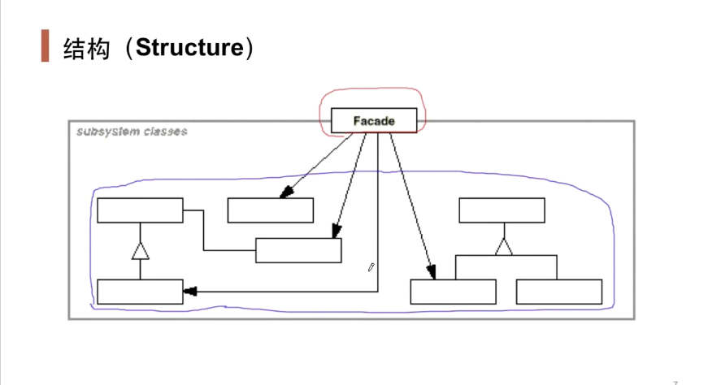

Façade 模式在具体实现过程中，没有一种特定的代码结构。 甚至看起来相差非常大的代码它可能表达的都是Façade 模式。 

 实际上Façade 模式它体现的是一种设计原则和一种思想的表达，也就是在子系统内部和外部一种解耦的方式。

##### 4、要的总结

```shell
要的总结：
1、从客户程序的角度来看，Façade 模式简化了整个组件系统的接口，对于组件内部与外部客户程序来说，达到了一种"解耦"的效果---内部子系统的任何变化不会影响到Façade 接口的变化。
2、Façade 设计模式更注重从架构的层次去看整个系统，而不是单个类的层次。Façade 很多时候更是一种架构设计模式。
3、Façade 设计模式并非一个集装箱，可以任意地放进任何多个对象。Façade 模式中组件的内部应该是"相互耦合关系比较大的一系列组件"，而不是一个简单的功能集合。

```


#### 十三、代理模式（Proxy）

对应代码chapter15

##### 1、"接口隔离"模式

```shell
 在组件构建过程中，某些接口之间直接的依赖常常会带来很多问题、甚至根本无法实现。采用添加一层间接（稳定）接口，来隔离本来互相紧密关联的接口是一种常见的解决方案。
```

##### 2、动机

```
1、在面向对象系统中，有些对象由于某种原因(比如对象创建的开销很多，或者某些操作需要安全控制，或者需要进程外的访问的等)，直接访问会给使用者、或者系统结构带来很多麻烦。
2、如何在不失去透明操作对象的同时来管理/控制这些对象特有的复杂性？增加一层间接层是软件开发中常见的解决方式。

透明操作--一致性，还能不能用同样的方式进行访问，
```

##### 3、模式定义

```
为其他对象提供一种代理以控制（隔离，使用接口）对这个对象的访问。
```

##### 4、要的总结

```
1、"增加一层间接层"是软件系统中对许多复杂问题的一种常见解决方法。在面向对象系统中，直接使用某些对象会带来很多问题，
作为间接层的proxy对象便是解决这一问题的常用手段。
2、具体proxy设计模式的实现方法、实现粒度都相差很大，有些可能对单个对象做细粒度的控制，如copy-on-write技术，有些可能
对组件模块提供抽象代理层，在架构层次对对象做proxy。
3、proxy并不一定要求保持接口完整的一致性，只要能够实现间接控制，有时候损及一些透明性是可以接受的。

```

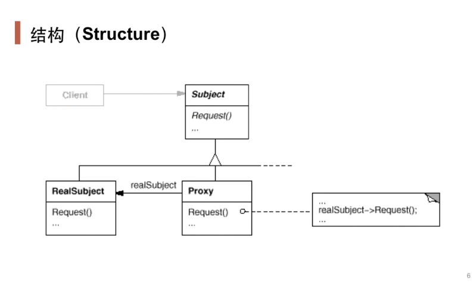

结构看似简单，但是实际真正上去实现的时候 就不是那么容易，它需要很多层面的配合。


#### 十四、适配器（Adapter）

对应代码chapter16

##### 1、"接口隔离"模式

```
 在组件构建过程中，某些接口之间直接的依赖常常会带来很多问题、甚至根本无法实现。采用添加一层间接（稳定）接口，来隔离本来互相紧密关联的接口是一种常见的解决方案。
```

##### 2、动机

```
1、在软件系统中，由于应用环境的变化，常常需要将"一些现存的对象"放在新的环境中应用，但是新环境要求的接口是这些现存对象所不满足的。
2、如何应对这种"迁移的变化"？如何既能利用现有对象的良好实现，同时又能满足新的应用环境所要求的接口？
```

##### 3、模式定义

```
将一个类的接口转换成客户希望的另一个接口。Adapter模式使得原本由于接口不兼容而不能一起工作的那些类可以一起工作。
```

##### 4、要的总结

```
1、Adapter模式主要应用于"希望复用一些现存的类，但是接口又与复用环境要求不一致的情况"，在遗留代码复用，类库迁移等方面非常有用。
2、GoF 23定义了两种Adapter模式的实现结构：对象适配器和类适配器。但类适配器采用"多继承"的实现方式，一般不推荐使用。对象适配器采用"对象组合"的方式，更符合松耦合精神。
3、Adapter模式可以实现的非常灵活，不必拘泥于GoF 23中定义的两种结构。例如，完全可以将Adapter模式中的"现存对象"作为新的接口方法参数，来达到适配的目的。
```


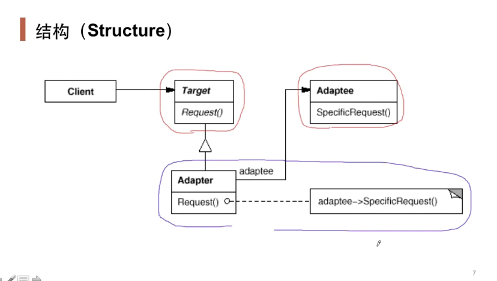

继承一个类实际则表明，遵循这个基类定义的接口规范。 


#### 十五、中介者（Mediator）

对应代码chapter18

##### 1、"接口隔离"模式

```
在组件构建过程中，某些接口之间直接的依赖常常会带来很多问题、甚至根本无法实现。采用添加一层间接（稳定）接口，来隔离本来互相紧密关联的接口是一种常见的解决方案。
```

##### 2、动机

```
1、在软件构建过程中，经常会出现多个对象互相关联交互的情况，对象之间常常会维持一种复杂的引用关系，如果遇到一些需求的更改，这种直接的引用关系将面临不断的变化。
2、在这种情况下，我们可使用一个"中介对象"来管理对象间的关联关系，避免相互交互的对象之间的紧耦合引用关系，从而更好地抵御变化。

```

##### 3、模式定义

```
 用一个中介对象来封装（封装变化） 一系列的对象交互。中介者使各对象不需要显式的相互引用（编译时依赖-----> 运行时依赖），从而使其耦合松散（管理变化），而且可以独立地改变它们之间的交互。

```

##### 4、要的总结

```
1、将多个对象间复杂的关联关系解耦，Mediator模式将多个对象间的控制逻辑进行集中管理，变"多个对象互相关联"为"多个对象和一个中间者关联"，简化了系统的维护，抵御了可能的变化。
2、随着控制逻辑的复杂化，Mediator具体对象的实现可能相当复杂。这时候可以对Mediator对象进行分解处理。
3、Façade 模式是解耦系统间（单向）的对象关联关系；Mediator模式是解耦系统内各个对象之间（双向）的关联关系。
```

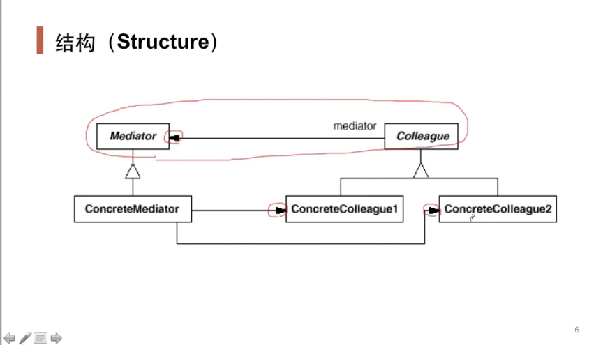


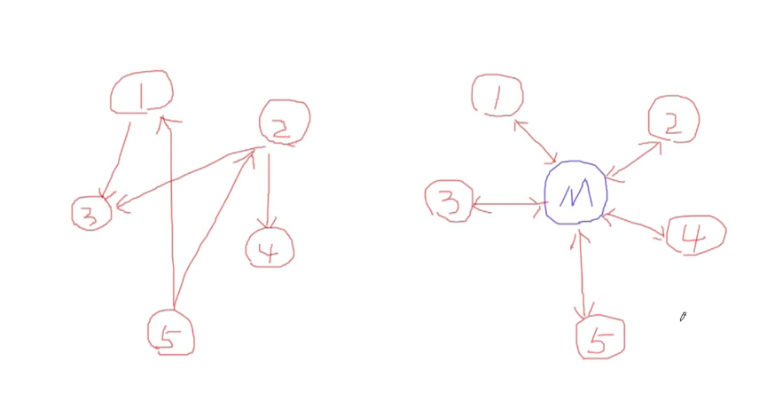

左边的是对象之间直接依赖，

右边的则是间接依赖，比如1向3发送消息，而1不直接和3依赖，而是通过中介者 M 来进行 调用。


#### 十六、状态模式(State)

对应代码chapter18

##### 1、状态变化模式

```
1、在组件构建过程中，某些对象的状态经常面临变化，如何对这些变化进行有效的管理？同时又维持高层模块的稳定？"状态变化"模式为这一问题提供了一种解决方案。

典型模式：
 .State
 .Memento
```

##### 2、动机

```
1、在软件构建过程中，某些对象的状态如果改变，其行为也会随之而发生变化，比如文档处于只读状态，其支持的行为和读写状态支持的行为就可能完全不同。
2、如何在运行时根据对象的状态来透明地更改对象的行为？而不会为对象操作和状态转化之间引入紧耦合？
```

##### 3、模式定义

```
 允许一个对象在其内部状态改变时改变它的行为。从而使对象看起来似乎修改了其行为。
```

###### 4、要的总结

```
1、State模式将所有与一个特定状态相关的行为都放入一个State的子类对象中，在对象状态切换时，切换相应的对象；但同时维持State的接口，这样实现了具体操作与状态转换之间的解耦。
2、为不同的状态引入不同的对象使得状态转换变得更加明确，而且可以保证不会出现状态不一致的情况，因为转换是原子性的-------即要么彻底转换过来，要么不转换。
3、如果State对象没有实例变量，那么各个上下文可以共享同一个State对象，从而节省对象开销。

```

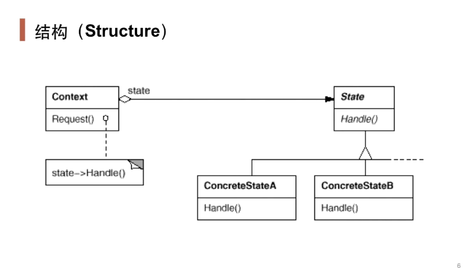

#### 17、备忘录（Memento）

对应代码chapter19

##### 1、状态变化模式

```
1、在组件构建过程中，某些对象的状态经常面临变化，如何对这些变化进行有效的管理？同时又维持高层模块的稳定？"状态变化"模式为这一问题提供了一种解决方案。

典型模式：
 .State
 .Memento
```

##### 2、动机

```
1、在软件构建过程中，某些对象的状态在转换过程中，可能由于某种需要，要求程序能够回溯到对象之前处于某个点时的状态。如果使用一些公有接口来让其它对象得到对象的状态，便会暴露对象的细节实现。
2、如何实现对象状态的良好保持和恢复？但同时又不会因此而破坏对象本身的封装性。
```

##### 3、模式定义

```
在不破坏封装性的前提下，捕获一个对象的内部状态，并在该对象之外保持这个状态。这样以后就可以将该对象恢复到原先保持的状态。
```

##### 4、要的总结

```
1、备忘录（Memento）存储原发器（Originator）对象的内部状态，在需要时恢复原发器状态。
2、Memento模式的核心是信息隐藏，即Originator需要向外接隐藏信息，保持器封装性。但同时又需要将状态保持到外界（Memento）
3、由于现代语言运行时（如C#、Java等）都具有相当的对象序列化支持，因此往往采用效率较高、又较容易正确实现的序列化方案类实现Memento模式。

```

对于有些设计模式从今天来讲 已经过时，现在有些模式采用效率比较高，比较容易的方式来

注意：随着时代发展，这种模式在现在用的不是特别多


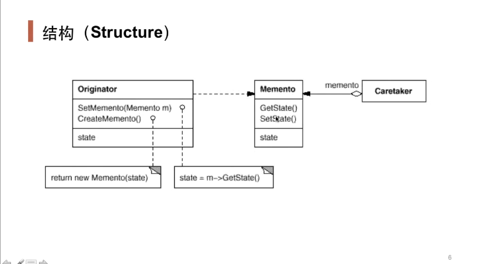


#### 十八、组合模式（Composite）

对应代码chapter20

##### 1、数据结构模式

```
1、常常有一些组件在内部具有特定的数据结构，如果让客户程序依赖这些特定的数据，将极大地破坏组件的复用。这时候，将这些特定数据结构封装在内部，在外部提供统一的接口，来实现与特定数据机构无关的访问，是一种行之有效的解决方案。

典型模式：
Composite
Iterator
Chain of Resposibility
```

##### 2、动机

```
1、在软件在某些情况下，客户代码过多地依赖于对象容器复杂的内部实现结构，对象容器内部实现结构（而非抽象接口）的变化将引起客户代码的频繁变化，带来了代码的维护性、扩展性等弊端。
2、如何将"客户代码与复杂的对象容器结构"解耦？让对象容器自己来实现自身的复杂结构，从而使得客户代码就像处理简单对象一样来处理复杂的对象容器？
```

##### 3、模式定义

```
将对象组合成树形结构以表示"部分--整体"的层次结构。Composite使得用户对单个对象和组合对象的使用具有一致性（稳定）。
```

##### 4、要的总结

```
1、Composite模式采用树形结构来实现普通存在的对象容器，从而将"一对多"的关系转化为"一对一"的关系，使得客户代码可以一致地（复用）处理对象和对象容器，无需关系处理的是单个的对象，还是组合的对象容器。
2、将"客户代码与复杂的对象容器结构"解耦是Composite的核心思想，解耦之后，客户代码将与纯粹的抽象接口----而非对象容器的内部实现结构----发生依赖，从而更能"应对变化"。
3、Composite模式在具体实现中，可以让父对象中的子对象反向追溯；如果父对象有频繁的遍历需求，可以使用缓存技巧来改善效率。

```


#### 十九、迭代器（Iterator）

对应代码chapter21

##### 1、“数据结构”模式

```
 1、常常有一些组件在内部具有特定的数据结构，如果让客户程序依赖这些特定的数据，将极大地破坏组件的复用。这时候，将这些特定数据结构封装在内部，在外部提供统一的接口，来实现与特定数据机构无关的访问，是一种行之有效的解决方案。

典型模式：
Composite
Iterator
Chain of Resposibility
```

##### 2、动机

```
1、在软件构建过程，集合对象内部结构常常变化各异。但对于这些集合对象，我们希望在不暴露其内部结构的同时，可以让外部客户代码透明地访问其中包含的元素；同时这种"透明遍历"也为"同一种算法在多种集合对象上进行操作"提供了可能。
2、使用面向对象技术将这种遍历机制抽象为"迭代器对象"为"应对变化中的集合对象"提供一种优雅的方式。
```

##### 3、模式定义

```
 提供一种方法顺序访问一个聚合对象中的各个元素，而又不暴露(稳定)该对象的内部表示。
```

##### 4、要的总结

```
1、迭代抽象：访问一个聚合对象的内容而无需暴露它的内部表示。
2、迭代多态：为遍历不同的集合结构提供一个统一的接口，从而支持同样的算法在不同的集合结构上进行操作。
3、迭代器的健壮性考虑：遍历的同时更改迭代器所在的集合结构，会导致问题。

如果要在C++中 使用迭代器模式 还是要回到C++泛型编程主导的 已模板多态主导的迭代器。
注意：随着时代发展，这种模式在现在用的不是特别多。在C++中发展出来了
更灵活的编译时多态，通过模板来支持更灵活的多态。

```


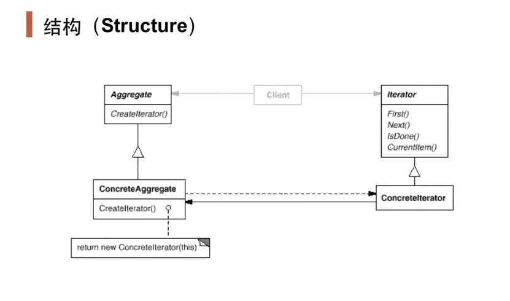

#### 二十、职责链（Chain of Resposibility）

对应代码chapter22

##### 1、“数据结构”模式

```
1、常常有一些组件在内部具有特定的数据结构，如果让客户程序依赖这些特定的数据，将极大地破坏组件的复用。这时候，将这些特定数据结构封装在内部，在外部提供统一的接口，来实现与特定数据机构无关的访问，是一种行之有效的解决方案。

典型模式：
Composite
Iterator
Chain of Resposibility
```

##### 2、动机

```
1、在软件构建过程中，一个请求可能被多个对象处理，但是多个请求在运行时只能有一个接受者，如果显式指定，将必不可少地带来请求发生者与接受者的紧耦合。
2、如何使请求的发送者不需要指定具体的接受者？让请求的接收者自己在运行时决定来处理请求，从而使两者解耦。
```

##### 3、模式定义

```
使多个对象都有机会处理请求，从而避免请求的发送者和接收者之间的耦合关系。将这些对象连城一条链，并沿着着这条链传递请求，直到有一个对象处理它为止。
```

##### 4、要的总结

```
1、Chain of Responsibilty 模式的应用场合在于"一个请求可能有多个接收者，但是最后真正的接受者只有一个"，这时候请求发送者与接受者的耦合有可能出现"变化脆弱"的症状，职责链的目的就是将二者解耦，从而更好地应对变化。
2、应用了Chain of Responsibilty 模式后，对象的职责分派将更具灵活性。我们可以在运行时动态添加/修改请求的处理职责。
3、如果请求传递到职责的末尾仍得不到处理，应该有一个合理的缺省机制。这也是每一个接受对象的责任，而不是发生请求的对象的责任。

注意：随着时代发展，这种模式在现在用的不是特别多。因为现有的数据结构
就可以表达了。
```

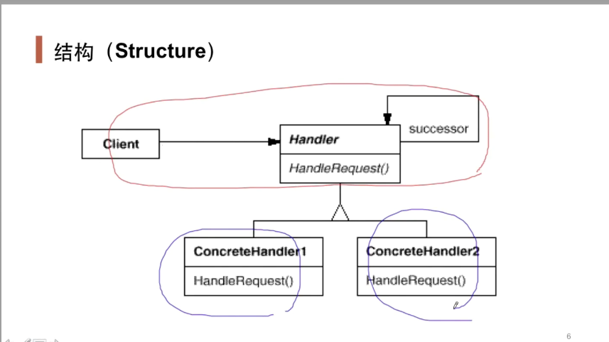


#### 二十一、命令模式（Command）

对应代码chapter23

##### 1、“行为变化”模式

```
1、在组件的构建过程中，组件行为的变化经常导致组件本身剧烈的变化。"行为变化"模式讲组件的行为和组件本身进行解耦，从而支持组件行为的变化，实现两者之间的松耦合。

典型模式：
Command
Visitor
```

##### 2、动机

```
1、在软件构建过程中，"行为请求者"与 "行为实现者"通常呈现一种"紧耦合"。但在某些场合----比如需要对行为"记录、撤销/重(undo/redo)、事务"等处理，这种无法抵御变化的紧耦合是不合适的。
2、在这种情况下，如何将"行为请求者"与"行为实现者"解耦？将一组行为抽象为对象，可以实现二者之间的松耦合。
```

##### 3、模式定义

```
 将一个请求(行为)封装为一个对象，从而使你可用不同的请求对客户进行参数化；对请求排队或记录请求日志，以及支持可撤销的操作。

```

##### 4、要的总结

```
1、Command模式的根本目的在于将"行为请求者"与"行为实现者"解耦，在面向对象语言中，常见的实现手段是“将行为抽象为对象”。
2、实现Command接口的具体命令对象ConcreteCommand有时候根据需要可能会保存一些额外的状态信息。通过使用Composite模式，可以将多个"命令"封装为一个"复合命令" MacroCommand。
3、Command模式与C++中的函数对象有些类似。但两者定义行为接口的规范有所区别：Command以面向对象中的"接口-实现"来定义行为接口的规范，更严格，但有性能损失；C++函数对象以函数签名来定义行为接口规范，更灵活，性能更高。

注意：随着时代发展，这种模式在现在用的不是特别多

```

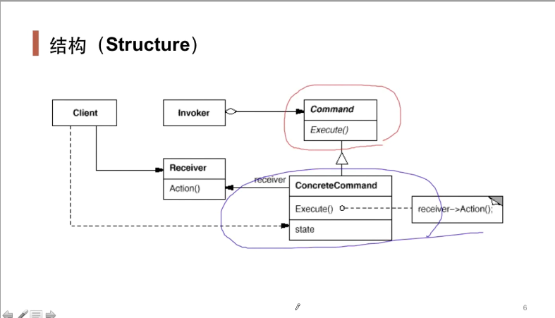


#### 二十二、访问器（Visitor）

对应代码chapter24

##### 1、“行为变化”模式

```
在组件的构建过程中，组件行为的变化经常导致组件本身剧烈的变化。"行为变化"模式讲组件的行为和组件本身进行解耦，从而支持组件行为的变化，实现两者之间的松耦合。

典型模式：
Command
Visitor
```

##### 2、动机

```
1、在软件构建过程中，由于需求的改变，某些类层次结构中常常需要增加新的行为(方法)，如果直接在基类中做这样的更改，将会该子类带来很繁重的变更负担，甚至破坏原有设计。
2、如何在不更改类层次结构的前提下，在运行时根据需要透明地为类层次结构上的各个类动态添加新的操作，从而避免上述问题？
```

##### 3、模式定义

```
 表示一个作用于某个对象结构中的各元素的操作。使得可以在不改变(稳定)各元素的类的前提下定义（扩展）作用于这些元素的新操作（变化）。
```

##### 4、要的总结

```
1、Visitor模式通过所谓双重分发(double dispatch) 来实现在不更改（不添加新的操作-编译时） Element类层次结构的前提下，在运行时透明地为类层次结构上的各个类动态添加新的操作（支持变化）。
2、所谓双重分发即Visitor模式中介包括了两个多态分发（注意其中的多态机制）：第一个为accept方法的多态辨析；第二个为
visitElementX方法的多态辨析。
3、Visitor模式的最大缺点在于扩展类层次结构（增添新的Element子类），会导致Visitor类的改变。因此Visitor模式适用于"Element类层次结构稳定，而其中的操作却经常面临频繁改动"。
```


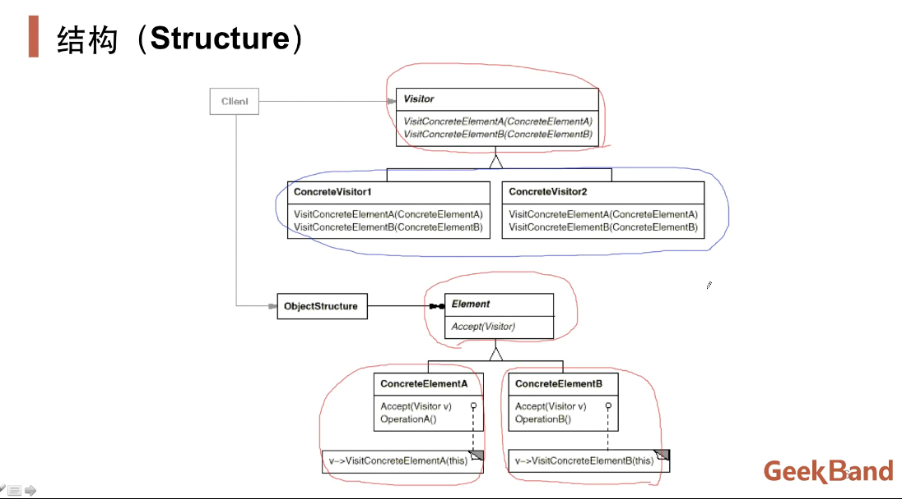


#### 二十三、解析器（Interpreter）

 对应代码chapter25

##### 1、"领域规则"模式：

```
 在特定领域中，某些变化虽然频繁，但可以抽象为某种规则。这时候，结合特定领域，将问题抽象为语法规则，从而给出在该领域下的一般性解决方案。

典型模式：
 Interprter  
```

##### 2、动机

```
1、在软件构建过程中，如果某一特定领域的问题比较复杂，类似的结构不断重复出现，如果使用普通的编程方式来实现将面临非常频繁的变化。
2、在这种情况下，将特定领域的问题表达为某种语法规则下的句子，然后构建一个解释器来解释这样的句子，从而达到解决问题的目的。
```

##### 3、模式定义

```
给定一个语言，定义它的文法的一种表示，并定义一种解释器，这个解释器使用该表示来解释语言中的句子。

```

##### 4、要的总结

```
1、Interprter模式的应用场合是Interprter模式应用中的难点，只有满足"业务规则频繁变化，且类似的结构不断重复出现，并且容易抽象为语法规则的问题"才适合使用Interprter模式。
2、使用Interprter模式来表示文法规则，从而可以使用面向对象技巧来方便地 "扩展"文法。
3、Interprter模式比较适合简单的文法表示，对于复杂的文法表示，Interprter模式会产生比较大的类层次结构，需要求助于语法分析器这样的标准工具。
```

注意：随着时代发展，这种模式在现在用的不是特别多。

如果是某些小语言 或比较清晰的模型可以用这种文法语言来解决。

如果更重的话这种 方式也无法解决。性能也会出问题，管理复杂度也会提升

通常就会采用一些开源的工具来处理了。


构成一个结构

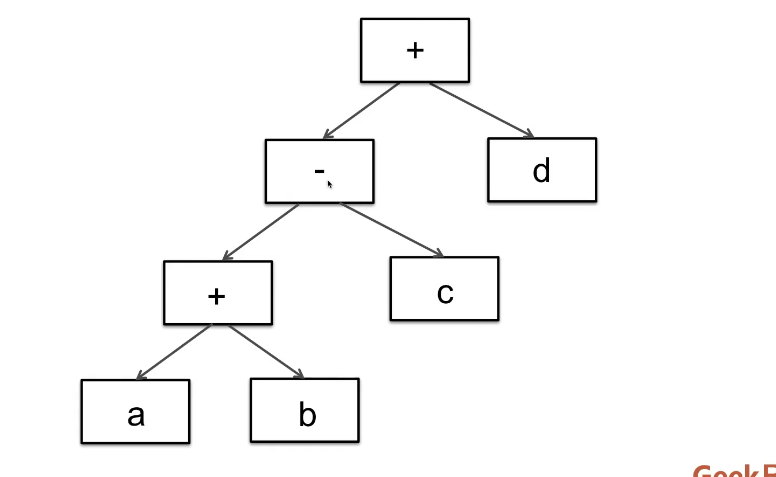


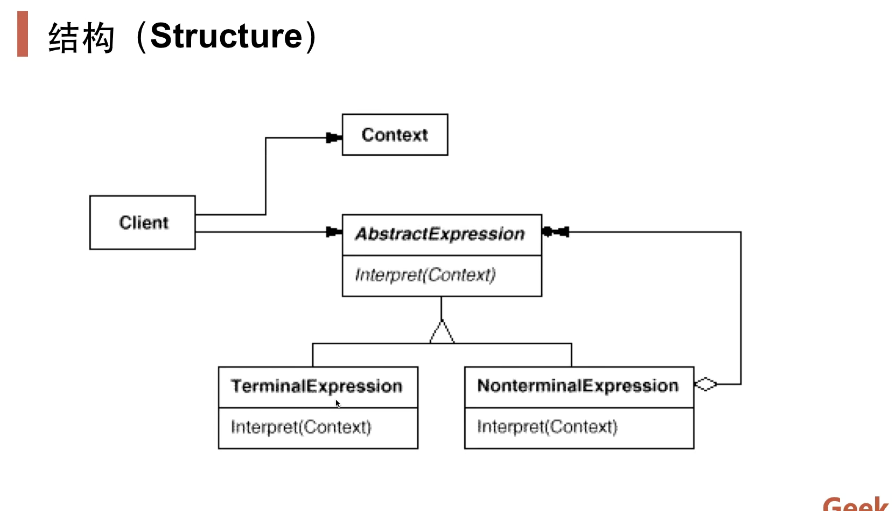

TerminalExpression：表示叶子节点 也就是上面树形图中a、b一样。


#### 二十四、设计模式总结

```
一个目标：
 管理变化，提供复用。
```

```
重构技法：
1、静态-->动态
2、早绑定-->晚绑定
3、继承-->组合
4、编译时依赖-->运行时依赖
5、紧耦合-->松耦合
```

```
什么时候不用模式：
1、代码可读性很差时
2、需求理解还很浅时
3、变化没有显现时
4、不是系统的关键依赖点
5、项目没有复用价值时
6、项目将要发布时

```

```
经验之谈：
1、不要为模式而模式
2、关注抽象类&接口
3、理清变化点和稳定点
4、审视依赖关系
5、要有Framework 和Application的区隔思维
6、良好的设计是演化的结果

```

```
设计模式成长之路(哈哈)：
1、手中无剑，心中无剑: 见模式而不知
2、手中有剑，心中无剑：可以识别模式，作为应用开发人员使用模式
3、手中有剑，心中有剑：作为框架开发人员为应用设计某些模式
4、手中无剑，心中有剑:  忘掉模式，只有原则

```

